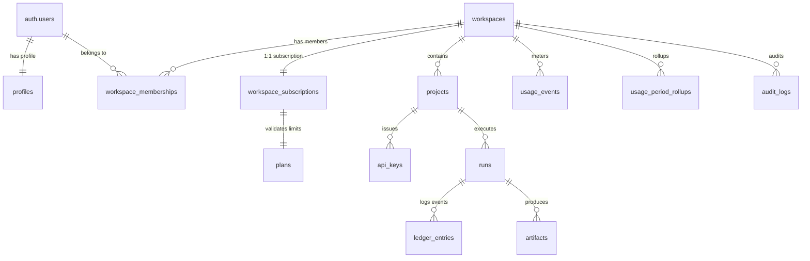

# ThoughtBox Data Model (v1)

> [!NOTE]
> This model treats Supabase as the control plane and GCP as the execution plane. Supabase Auth manages identity, while Postgres (via Supabase) handles tenancy, billing state, and trace metadata.

## Core Boundaries

1. **User** — Who signed in.
2. **Workspace** — Billing and tenancy boundary.
3. **Project** — Logical product boundary inside a workspace.
4. **Run** — One execution, trace, or invocation.
5. **Ledger entry** — One append-only record inside a run.

## Design Rules for v1

1. **Workspace Scope**: Every tenant-scoped row gets `workspace_id`. This keeps RLS and administrative reasoning simple.
2. **Mutability**: Control-plane tables are mutable (workspaces, memberships, plans, subscriptions, api_keys). Execution-plane tables are append-only (runs, ledger_entries, usage_events, audit_logs).
3. **Security**: Never store raw API keys. Store `prefix` + `hash` + `metadata`.
4. **Blob Storage**: Large blobs do not live in hot tables. Put them in Storage (buckets); keep metadata in Postgres.
5. **JSON Usage**: Use JSON only at the edges. Core query fields should be first-class columns. JSON is for extension, not primary shape.

---

## v1 Schema

### 0. Supabase-Managed Pieces

- `auth.users`: User identity.
- `auth.sessions`: Active sessions.
- **Storage Buckets**: For artifacts and exports.

### 1. `profiles`
One row per signed-in user.

- **PK / FK**: `user_id` -> `auth.users.id`
- **Fields**: `display_name`, `default_workspace_id` (nullable), `created_at`, `updated_at`.
- **Purpose**: App-level user profile, default workspace selection, and future preferences.

### 2. `workspaces`
Top-level tenant and billing boundary.

- **Fields**: `id`, `name`, `slug`, `status` (active, suspended, archived), `owner_user_id`, `created_at`, `updated_at`.
- **Purpose**: Represents one paying entity, one retention/entitlement boundary, and the top-level RLS boundary.

### 3. `workspace_memberships`
Many-to-many between users and workspaces.

- **Fields**: `workspace_id`, `user_id`, `role` (owner, admin, member), `invited_by_user_id` (nullable), `created_at`.
- **Purpose**: Access control and team support.

### 4. `plans`
Global plan definitions.

- **Fields**: `id`, `slug` (free, pro), `display_name`, `monthly_price_cents`, `max_projects`, `max_api_keys`, `retention_days`, `export_enabled`, `search_enabled`, `priority_support`, `fair_use_notes`, `created_at`, `updated_at`.
- **Purpose**: Explicit plan logic; avoids opaque "entitlements JSON" for core limits.

### 5. `workspace_subscriptions`
Mirrored billing state for each workspace.

- **Fields**: `workspace_id` (unique), `plan_id`, `provider` (stripe), `provider_customer_id`, `provider_subscription_id`, `status` (trialing, active, past_due, canceled, incomplete), `current_period_start`, `current_period_end`, `cancel_at_period_end`, `created_at`, `updated_at`.
- **Purpose**: Tracks active plans and what the app should allow in real-time.

### 6. `projects`
Primary product grouping inside a workspace.

- **Fields**: `id`, `workspace_id`, `name`, `slug`, `description` (nullable), `status` (active, archived), `created_by_user_id`, `created_at`, `updated_at`.
- **Purpose**: The object users think in terms of; main grouping for keys, runs, and artifacts.

### 7. `api_keys`
Customer-issued ThoughtBox API keys.

- **Fields**: `id`, `workspace_id`, `project_id`, `name`, `key_prefix`, `key_hash`, `status` (active, revoked), `last_used_at` (nullable), `expires_at` (nullable), `created_by_user_id`, `revoked_at` (nullable), `created_at`.
- **Purpose**: Self-serve access, revocation, and per-project isolation.
- **Note**: Do not mix these up with Supabase’s internal project keys.

### 8. `runs`
Top-level execution records.

- **Fields**: `id`, `workspace_id`, `project_id`, `api_key_id` (nullable), `external_run_id` (nullable), `source_type` (api, mcp, dashboard, import), `status` (queued, running, succeeded, failed, canceled), `model_name` (nullable), `request_id` (nullable), `started_at`, `ended_at` (nullable), `duration_ms` (nullable), `input_summary` (nullable), `output_summary` (nullable), `error_summary` (nullable), `retention_expires_at`, `metadata_jsonb`, `created_at`.
- **Purpose**: Main trace/search row; anchor for the ledger explorer.

### 9. `ledger_entries`
Append-only records within a run.

- **Fields**: `id`, `workspace_id`, `project_id`, `run_id`, `seq`, `parent_entry_id` (nullable), `entry_type` (`input`, `thought`, `tool_call`, `tool_result`, `observation`, `decision`, `error`, `output`, `system`), `loop_type` (`instrumentation`, `reality`, `model`, `intervention`), `visibility` (`user`, `internal`), `content_text` (nullable), `content_jsonb` (nullable), `created_at`.
- **Purpose**: The actual ThoughtBox "wedge"; provides structured view of execution traces.
- **Rationale**: `entry_type` handles general trace semantics, while `loop_type` preserves the four-loop framing.

### 10. `artifacts`
Files or blobs associated with runs.

- **Fields**: `id`, `workspace_id`, `project_id`, `run_id`, `ledger_entry_id` (nullable), `artifact_type` (`attachment`, `export`, `input_blob`, `output_blob`, `screenshot`, `trace_dump`), `storage_bucket`, `storage_path`, `mime_type`, `byte_size`, `metadata_jsonb`, `created_at`.
- **Purpose**: Keeps heavy payloads out of table rows; simplifies exports and downloads.

### 11. `usage_events`
Immutable raw metering facts.

- **Fields**: `id`, `workspace_id`, `project_id` (nullable), `run_id` (nullable), `event_type` (`run_started`, `run_completed`, `ledger_entry_written`, `artifact_stored`, `export_created`), `quantity`, `unit` (`runs`, `entries`, `bytes`, `exports`), `occurred_at`, `metadata_jsonb`.
- **Purpose**: Raw source of truth for usage; allows rollup logic changes without data loss.

### 12. `usage_period_rollups`
Precomputed usage for dashboard and enforcement.

- **Fields**: `workspace_id`, `period_start`, `period_end`, `runs_count`, `ledger_entries_count`, `storage_bytes`, `exports_count`, `updated_at`.
- **Purpose**: Performance-optimized usage page and enforcement checks.

### 13. `audit_logs`
Control-plane audit trail.

- **Fields**: `id`, `workspace_id`, `actor_user_id` (nullable), `actor_api_key_id` (nullable), `target_type`, `target_id`, `action`, `diff_jsonb` (nullable), `occurred_at`.
- **Purpose**: Internal trust and debugging (e.g., tracking key revocations or plan changes).

---

## Relationship Map

---

## Page Map

### Public
1. **Home**: Value prop, "what ThoughtBox is", CTA.
2. **Pricing**: Free vs. Paid (plans table).
3. **Docs / Quickstart**: Implementation guide.
4. **Sign up / Sign in**: Auth entry (auth.users, profiles).
5. **Terms / Privacy**: Mandatory trust layer.

### Private App
1. **Overview**: Current workspace, plan/usage summary, recent runs/failures.
2. **Projects**: List of projects in workspace.
3. **Project Detail**: Metadata, API keys, recent runs, quickstart, limits.
4. **Trace Explorer**: Searchable list of runs (status, timing, summaries).
5. **Run Detail**: Single-run inspection (ledger timeline, artifacts, export).
6. **API Keys**: Key management.
7. **Usage**: Transparent limits and consumption.
8. **Billing**: Subscription status.
9. **Workspace Settings**: General settings and memberships.
10. **Account Settings**: User-level preferences.

---

## V1 Omissions (Future Work)
- Organizations above workspaces.
- Per-seat billing.
- SSO / SCIM.
- Project environments as separate tables.
- Webhook subscriptions.
- Saved searches.
- Annotations/comments on ledger entries.
- Fine-grained key scopes.

## Build Order
1. **Foundation**: `profiles`, `workspaces`, `workspace_memberships`, `projects`
2. **Entitlements**: `plans`, `workspace_subscriptions`, `api_keys`
3. **Tracing**: `runs`, `ledger_entries`, `artifacts`
4. **Metering**: `usage_events`, `usage_period_rollups`, `audit_logs`
5. **UI**: Page shells and detail views.

> [!IMPORTANT]
> The **Run Detail** and **Trace Explorer** are not secondary admin views—they are the core product.
