# Continual Improvement Specs Index

| File | Status | Parent | Dependencies |
| --- | --- | --- | --- |
| [Continual Self-Improvement System: Architecture Overview](00-overview.md) | Draft v0.1 |  | | **Beads** | SQLite + JSONL | Issue tracking, dependencies, status | CLI queries | |
| [01: Unified Loop Controller](01-unified-loop-controller.md) | Draft v0.1 |  | [02-knowledge-accumulation-layer.md](./02-knowledge-accumulation-layer.md) (soft), [04-cross-session-continuity.md](./04-cross-session-continuity.md) (soft) |
| [SPEC-CI-002: Knowledge Accumulation Layer](02-knowledge-accumulation-layer.md) | Draft v0.2 | [00-overview.md](./00-overview.md) -- Gap 2 | None (this spec is a soft dependency of [01-unified-loop-controller.md](./01-unified-loop-controller.md)) |
| [SPEC-CI-003: Automated Pattern Evolution (DGM/CycleQD)](03-automated-pattern-evolution.md) | Draft v0.1 | [00-overview.md](./00-overview.md) -- Gap 3 |  |
| [04: Cross-Session Continuity](04-cross-session-continuity.md) | Draft v0.2 | [00-overview.md](./00-overview.md) (Gap 4) |  |
| [Spec 05: Evaluation Harness](05-evaluation-harness.md) | Draft v0.1 | [00-overview.md](./00-overview.md) -- Gap 5 |  |
| [SPEC-CI-006: Agent Team Orchestration](06-agent-team-orchestration.md) | Draft v0.1 | [00-overview.md](./00-overview.md) -- Gap 6 | [02-knowledge-accumulation-layer.md](./02-knowledge-accumulation-layer.md) (soft), [04-cross-session-continuity.md](./04-cross-session-continuity.md) (soft) |
| [Spec 07: Assumption Registry](07-assumption-registry.md) | Draft v0.1 | [00-overview.md](./00-overview.md) — Gap 7 |  |
| [Spec 08: Compound Engineering Integration](08-compound-integration.md) | Draft v0.1 | [00-overview.md](./00-overview.md) (Gap 8: Compound Engineering Not Integrated) |  |
| [Implementation Plan: Continual Self-Improvement System](09-implementation-plan.md) | Draft v0.1 |  | Specs 01-08 in this directory |
| [Compound Document: Continual Self-Improvement System Design](COMPOUND.md) | | Skills | 5 | session-review, knowledge, assumptions, eval, loop-status | |  |  |

## Dependency Graph

```mermaid
flowchart TD
  _00_overview_md____00_overview_md_____Gap_2 --> 02_knowledge_accumulation_layer_md
  _00_overview_md____00_overview_md_____Gap_3 --> 03_automated_pattern_evolution_md
  _00_overview_md____00_overview_md___Gap_4_ --> 04_cross_session_continuity_md
  _00_overview_md____00_overview_md_____Gap_5 --> 05_evaluation_harness_md
  _00_overview_md____00_overview_md_____Gap_6 --> 06_agent_team_orchestration_md
  _00_overview_md____00_overview_md____Gap_7 --> 07_assumption_registry_md
  _00_overview_md____00_overview_md___Gap_8__Compound_Engineering_Not_Integrated_ --> 08_compound_integration_md
```

_Generated by `scripts/utils/spec-index.mjs`._
