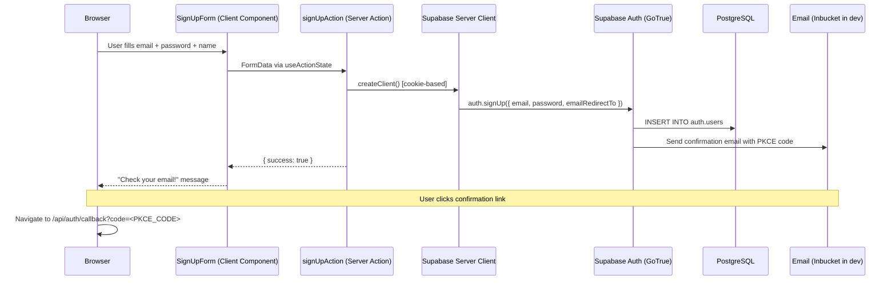
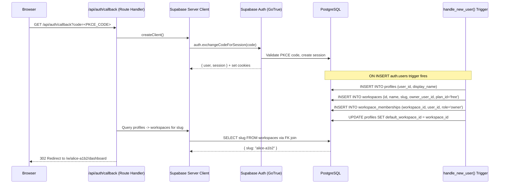
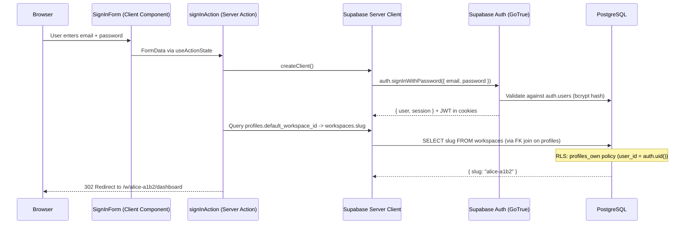
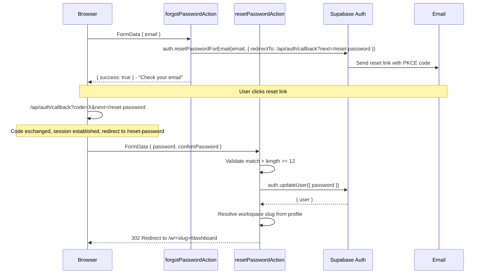
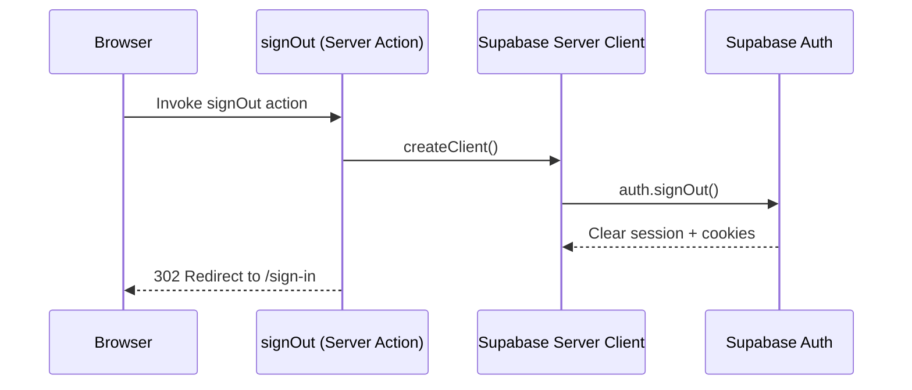
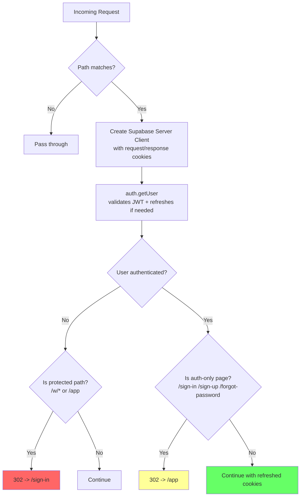
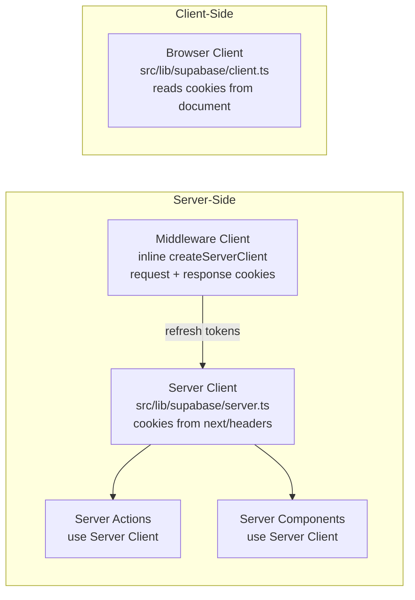
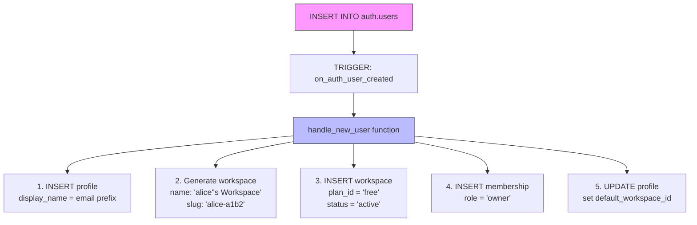
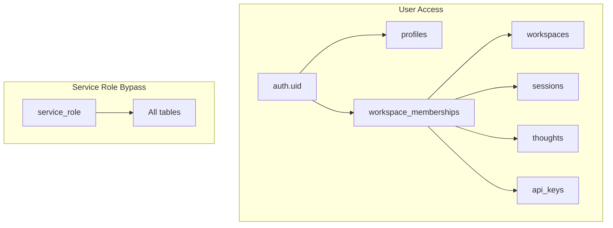

# Thoughtbox Authentication & Authorization Flow Analysis

**Date:** 2026-03-20
**Branch:** `feat/supabase-v1-alignment`
**Scope:** End-to-end auth from user action through Next.js middleware to Supabase database persistence

---

## 1. Architecture Overview

```
+------------------+     +-------------------+     +-------------------+     +------------------+
|   Browser        | --> |  Next.js 15       | --> |  Supabase Auth    | --> |  PostgreSQL      |
|   (Client)       |     |  (App Router)     |     |  (GoTrue)         |     |  (auth.users +   |
|                  |     |  + Middleware      |     |  JWT + PKCE       |     |   public.*)      |
+------------------+     +-------------------+     +-------------------+     +------------------+
```

### Key Technologies

| Layer | Technology | Purpose |
|-------|-----------|---------|
| Client | `@supabase/ssr` `createBrowserClient` | Browser-side Supabase client |
| Server Components | `@supabase/ssr` `createServerClient` | Cookie-based server client |
| Middleware | `@supabase/ssr` `createServerClient` (inline) | Session refresh + route protection |
| Auth Backend | Supabase Auth (GoTrue) | JWT issuance, PKCE, password hashing |
| Database | PostgreSQL with RLS | Row-level security enforcement |

---

## 2. Authentication Flows

### 2.1 Email/Password Sign-Up



**Source files:**
- `src/app/(auth)/sign-up/SignUpForm.tsx` - Client form using `useActionState`
- `src/app/(auth)/actions.ts:50-75` - `signUpAction` Server Action
- `src/lib/supabase/server.ts` - Server client factory

### 2.2 Email Confirmation / OAuth Callback



**Source files:**
- `src/app/api/auth/callback/route.ts` - PKCE code exchange
- `supabase/migrations/20260321004644_remote_schema.sql:294-325` - `handle_new_user()` trigger function
- `supabase/migrations/20260321004644_remote_schema.sql:1554` - Trigger binding: `on_auth_user_created`

### 2.3 Email/Password Sign-In



**Source files:**
- `src/app/(auth)/sign-in/SignInForm.tsx` - Client form
- `src/app/(auth)/actions.ts:15-46` - `signInAction` Server Action

### 2.4 Password Reset Flow



**Source files:**
- `src/app/(auth)/actions.ts:79-99` - `forgotPasswordAction`
- `src/app/(auth)/actions.ts:103-136` - `resetPasswordAction`

### 2.5 Sign Out



**Source file:** `src/app/actions.ts:6-10`

---

## 3. Session Management & Middleware

### 3.1 Middleware Session Refresh

Every matched request passes through middleware that refreshes the Supabase session.



**Matched routes:** `/w/:path*`, `/app`, `/sign-in`, `/sign-up`, `/forgot-password`

**Source file:** `middleware.ts`

### 3.2 Cookie-Based Token Storage

```
Browser Cookies
+-------------------------------------------+
| sb-<project-ref>-auth-token               |
|   Contains: { access_token, refresh_token }|
|   HttpOnly: true                           |
|   SameSite: Lax                            |
|   Secure: true (in production)             |
+-------------------------------------------+
```

Tokens are managed entirely by `@supabase/ssr` -- no manual cookie handling is needed. The server client reads cookies via `next/headers` `cookies()`, and the middleware creates its own client with request/response cookie access for session refresh propagation.

### 3.3 Supabase Client Architecture



---

## 4. Database Layer: Auto-Provisioning

### 4.1 The `handle_new_user()` Trigger

When a new user is created in `auth.users`, a PostgreSQL trigger automatically provisions their workspace:



**Tables written by trigger:**
| Table | Data |
|-------|------|
| `profiles` | `user_id`, `display_name` (email prefix) |
| `workspaces` | `id`, `name`, `slug`, `owner_user_id`, `status='active'`, `plan_id='free'` |
| `workspace_memberships` | `workspace_id`, `user_id`, `role='owner'` |
| `profiles` (update) | `default_workspace_id` set to new workspace |

**Slug format:** `<email_prefix>-<first_4_hex_of_uuid>` (e.g., `alice-a1b2`)

---

## 5. Authorization: Row-Level Security (RLS)

All public tables have RLS enabled. Authorization is enforced at the database level via `auth.uid()`.

### 5.1 RLS Policy Map



| Table | Policy | Rule |
|-------|--------|------|
| `profiles` | `profiles_own` | `user_id = auth.uid()` (SELECT + all ops) |
| `workspaces` | `workspaces_select_member` | EXISTS membership where `user_id = auth.uid()` |
| `workspaces` | `workspaces_insert_authenticated` | `owner_user_id = auth.uid()` |
| `workspaces` | `workspaces_update_admin` | Membership with role `owner` or `admin` |
| `workspaces` | `workspaces_delete_owner` | `owner_user_id = auth.uid()` |
| `workspace_memberships` | `memberships_select_own` | `user_id = auth.uid()` |
| `sessions` | `sessions_member_access` | `is_workspace_member(workspace_id)` |
| `thoughts` | `thoughts_member_access` | `is_workspace_member(workspace_id)` |
| `api_keys` | `api_keys_member_access` | `is_workspace_member(workspace_id)` |
| `api_keys` | `api_keys_anon_validate` | `anon` can SELECT (for key validation) |
| `entities` | `service_role_bypass` | Only `service_role` has access |
| `observations` | `service_role_bypass` | Only `service_role` has access |
| `relations` | `service_role_bypass` | Only `service_role` has access |

### 5.2 `is_workspace_member()` Helper

```sql
-- SECURITY DEFINER: runs as function owner, not caller
CREATE FUNCTION is_workspace_member(ws_id UUID) RETURNS BOOLEAN AS $$
  SELECT EXISTS (
    SELECT 1 FROM workspace_memberships
    WHERE workspace_id = ws_id AND user_id = auth.uid()
  );
$$ LANGUAGE sql STABLE SECURITY DEFINER;
```

This function is the core authorization primitive -- it checks if the current authenticated user has any membership in the given workspace.

---

## 6. Complete Data Flow Diagram

```mermaid
flowchart TB
    subgraph "1. Authentication"
        direction LR
        UI[Auth Forms<br/>sign-in / sign-up / reset] -->|FormData| ACT[Server Actions<br/>src/app/(auth)/actions.ts]
        ACT -->|@supabase/ssr| AUTH[Supabase Auth<br/>GoTrue]
        AUTH -->|JWT + refresh token| COOK[HTTP-Only Cookies]
        LINK[Email Links] -->|PKCE code| CB[/api/auth/callback<br/>exchangeCodeForSession]
        CB --> AUTH
    end

    subgraph "2. Session Persistence"
        direction LR
        COOK --> MW[Middleware<br/>middleware.ts]
        MW -->|auth.getUser| REFRESH[Token Refresh]
        REFRESH -->|updated cookies| RESP[Response]
    end

    subgraph "3. Route Protection"
        direction LR
        MW -->|no user + /w/*| REDIR1[302 /sign-in]
        MW -->|user + /sign-in| REDIR2[302 /app]
        MW -->|user + /w/*| ALLOW[Allow through]
    end

    subgraph "4. Auto-Provisioning (DB Trigger)"
        direction TB
        AUTH -->|new user| TRG[on_auth_user_created trigger]
        TRG --> PROF[profiles]
        TRG --> WS[workspaces]
        TRG --> MEM[workspace_memberships]
    end

    subgraph "5. Data Access (RLS)"
        direction TB
        ALLOW --> SC2[Server Component<br/>Server Client]
        SC2 -->|JWT in cookie| PG[PostgreSQL]
        PG -->|auth.uid from JWT| RLS[RLS Policies]
        RLS --> DATA[Workspace Data:<br/>sessions, thoughts,<br/>api_keys]
    end
```

---

## 7. Entity Relationship Diagram (Auth-Related Tables)

```mermaid
erDiagram
    AUTH_USERS ||--|| PROFILES : "1:1 (trigger-created)"
    AUTH_USERS ||--o{ WORKSPACE_MEMBERSHIPS : "has many"
    WORKSPACES ||--o{ WORKSPACE_MEMBERSHIPS : "has many"
    PROFILES ||--o| WORKSPACES : "default_workspace_id FK"
    WORKSPACES ||--|| AUTH_USERS : "owner_user_id FK"
    WORKSPACES ||--o{ SESSIONS : "has many"
    WORKSPACES ||--o{ API_KEYS : "has many"
    SESSIONS ||--o{ THOUGHTS : "has many"
    AUTH_USERS ||--o{ API_KEYS : "created_by_user_id FK"

    AUTH_USERS {
        uuid id PK
        text email
        text encrypted_password
        timestamp created_at
    }

    PROFILES {
        uuid user_id PK_FK
        text display_name
        uuid default_workspace_id FK
        timestamp created_at
        timestamp updated_at
    }

    WORKSPACES {
        uuid id PK
        text name
        text slug UK
        text status
        uuid owner_user_id FK
        text plan_id
        text subscription_status
        text stripe_customer_id
        text stripe_subscription_id
        timestamp created_at
    }

    WORKSPACE_MEMBERSHIPS {
        uuid workspace_id PK_FK
        uuid user_id PK_FK
        text role
        uuid invited_by_user_id FK
        timestamp created_at
    }

    SESSIONS {
        uuid id PK
        uuid workspace_id FK
        text title
        text status
        integer thought_count
        integer branch_count
    }

    THOUGHTS {
        uuid id PK
        uuid session_id FK
        uuid workspace_id FK
        text thought
        integer thought_number
        text thought_type
    }

    API_KEYS {
        uuid id PK
        uuid workspace_id FK
        text name
        text prefix
        text key_hash
        text status
        uuid created_by_user_id FK
    }
```

---

## 8. Auth Configuration Summary

| Setting | Value | Source |
|---------|-------|--------|
| JWT expiry | 3600s (1 hour) | `supabase/config.toml:107` |
| Refresh token rotation | Enabled | `supabase/config.toml:109` |
| Refresh reuse interval | 10s | `supabase/config.toml:112` |
| Email confirmations | Disabled (dev) | `supabase/config.toml:138` |
| Anonymous sign-ins | Disabled | `supabase/config.toml:116` |
| Minimum password (Supabase) | 6 chars | `supabase/config.toml:120` |
| Minimum password (App) | 12 chars | `src/app/(auth)/actions.ts:114` |
| MFA TOTP | Disabled | `supabase/config.toml:204-205` |
| OAuth providers | None enabled | `supabase/config.toml:223+` |
| SMS auth | Disabled | `supabase/config.toml:163` |
| Site URL | `http://127.0.0.1:3000` | `supabase/config.toml:103` |

---

## 9. Security Observations

1. **Password length mismatch:** Supabase allows 6-char passwords (`config.toml:120`), but the app enforces 12 chars only on the reset-password form (`actions.ts:114`). The sign-up form has no server-side length validation beyond Supabase's 6-char minimum.

2. **`SECURITY DEFINER` functions:** `handle_new_user()`, `is_workspace_member()`, and `check_protocol_enforcement()` run with the function owner's privileges (postgres). This is correct for trigger functions and RLS helpers but should be audited periodically.

3. **Anon key for API key validation:** The `api_keys_anon_validate` policy allows unauthenticated reads on `api_keys`. This is intentional for MCP server key validation but means the `prefix` and `status` columns are exposed to anonymous users.

4. **MCP data tables (entities, observations, relations):** Only accessible via `service_role` -- no authenticated user can query these directly through the Supabase client. The MCP server uses the service role key.

5. **No OAuth providers configured:** Only email/password auth is active. OAuth callback handler is ready but unused.
