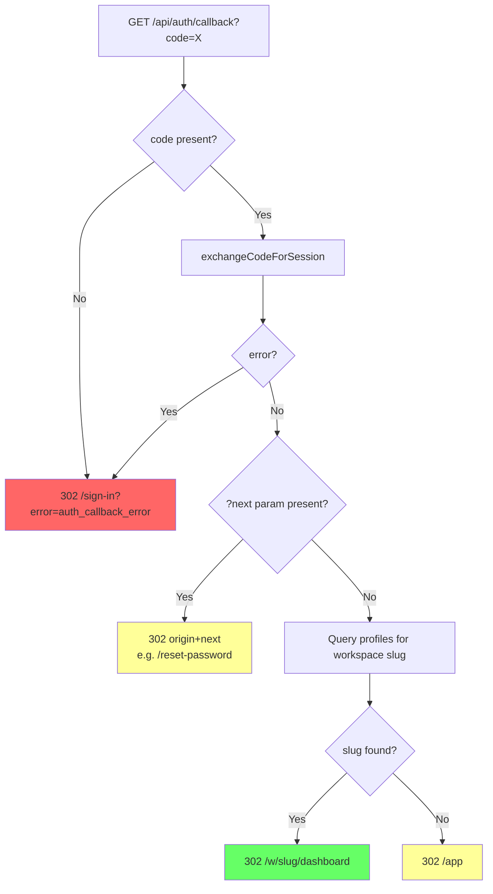
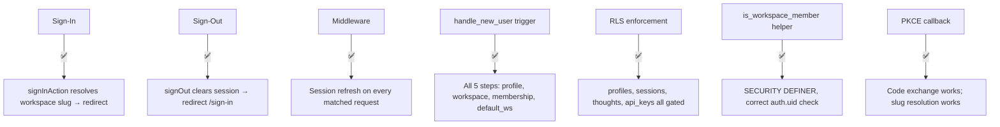

# Auth Flow Analysis: Accuracy Audit & Gap Report

**Date:** 2026-03-21
**Branch:** `feat/supabase-v1-alignment`
**Audits:** `reports/auth-flow-analysis.md` (dated 2026-03-20)
**Scope:** Cross-reference of auth-flow-analysis.md claims against source files, migration SQL, env config, and deployed Supabase project

---

## 1. Methodology

Each claim in `auth-flow-analysis.md` was verified against:

| Source | What was checked |
|--------|-----------------|
| `middleware.ts` | Route matching, redirect logic, session refresh |
| `src/app/(auth)/actions.ts` | All four server actions, line references, FormData reads |
| `src/app/actions.ts` | `signOut` action |
| `src/app/api/auth/callback/route.ts` | Code exchange, redirect branches, error handling |
| `src/lib/supabase/server.ts` | Server client factory |
| `src/lib/supabase/client.ts` | Browser client factory |
| `src/app/(auth)/sign-up/SignUpForm.tsx` | Form fields, action wiring |
| `src/app/(auth)/sign-in/SignInForm.tsx` | Form fields, action wiring |
| `src/app/(auth)/reset-password/ResetPasswordForm.tsx` | Form fields |
| `src/app/app/page.tsx` | `/app` fallback route behavior |
| `supabase/migrations/20260321004644_remote_schema.sql` | Trigger, RLS policies, functions |
| `supabase/config.toml` | Auth settings |
| `.env`, `.env.local`, `.env.example` | Environment variable naming and presence |

> **Note on MCP access:** Supabase and Vercel MCP servers are configured in `.mcp.json` for CLI use and are not available as IDE tool calls. Runtime state of the production Supabase instance (dashboard settings, live user data) could not be directly queried. Production auth settings are inferred from `config.toml` with caveats noted in §4.

---

## 2. Accuracy Verdict by Section

### 2.1 Overall Accuracy Map

```
+----------------------------+----------+------------------------------------------+
| Report Section             | Status   | Notes                                    |
+----------------------------+----------+------------------------------------------+
| §1 Architecture Overview   | ACCURATE | Layers and technologies correct          |
| §2.1 Sign-Up Flow          | PARTIAL  | Name field handling wrong; see §3.1      |
| §2.2 Callback Flow         | PARTIAL  | Missing ?next= branch and error path     |
| §2.3 Sign-In Flow          | ACCURATE | Exact match                              |
| §2.4 Password Reset Flow   | PARTIAL  | Callback branch undocumented; bug in SA  |
| §2.5 Sign Out              | ACCURATE | Exact match                              |
| §3.1 Middleware Refresh    | ACCURATE | Logic, matcher, redirects all match      |
| §3.2 Cookie Storage        | ACCURATE |                                          |
| §3.3 Client Architecture   | ACCURATE | Diagram matches implementation           |
| §4.1 handle_new_user()     | ACCURATE | SQL exact match at stated line numbers   |
| §5.1 RLS Policy Map        | PARTIAL  | One undocumented policy; see §3.3        |
| §5.2 is_workspace_member() | PARTIAL  | Overstates usage scope; see §3.4         |
| §6 Data Flow Diagram       | ACCURATE |                                          |
| §7 ERD                     | ACCURATE | Tables and columns match schema          |
| §8 Auth Config Summary     | MISLEADING | config.toml ≠ production config; §4     |
| §9 Security Observations   | ACCURATE | All 5 observations hold                  |
+----------------------------+----------+------------------------------------------+
```

---

## 3. Inaccuracies and Gaps

### 3.1 Sign-Up Form: Name Fields Are Dead UI

**Report claim (§2.1):** *"User fills email + password + name"* — implies name is captured and stored.

**Reality:** `SignUpForm.tsx` renders `firstName` and `lastName` inputs with labels, `autoComplete`, and placeholder text. `signUpAction` reads only `email` and `password`:

```typescript
// src/app/(auth)/actions.ts:54-55
const email = formData.get('email') as string
const password = formData.get('password') as string
```

`firstName` and `lastName` are never read from `FormData`. They are silently discarded. The `display_name` stored in `profiles` is always derived by the trigger from `split_part(email, '@', 1)` — the user's stated name has no effect on anything in the system.

**Source files:**
- `src/app/(auth)/sign-up/SignUpForm.tsx:32-58` — dead `firstName`/`lastName` inputs
- `src/app/(auth)/actions.ts:54-55` — only `email`/`password` read
- `supabase/migrations/20260321004644_remote_schema.sql:303-304` — trigger sets display_name from email

---

### 3.2 Callback Route: Missing Branches in §2.2 Sequence Diagram

**Report claim (§2.2):** The sequence shows a single linear path after `exchangeCodeForSession`: trigger fires, then the callback queries profiles for the workspace slug and redirects.

**Reality:** The callback has three distinct branches:



The `?next=` branch is the mechanism that powers the password reset flow (§2.4). The report describes the reset flow as if the callback transparently redirects to `/reset-password` without explaining how — the `?next=` query param is the mechanism, and it is entirely absent from the §2.2 diagram.

The `/app` fallback is also undocumented. `/app` (`src/app/app/page.tsx`) is not a landing page — it is itself a server component that re-resolves the workspace slug and issues a second redirect.

The error path — redirecting to `/sign-in?error=auth_callback_error` — is also missing from the report.

**Source files:**
- `src/app/api/auth/callback/route.ts:9-39` — full branching logic
- `src/app/app/page.tsx:1-20` — what `/app` actually does
- `src/app/(auth)/actions.ts:90-91` — `forgotPasswordAction` sets `?next=/reset-password`

---

### 3.3 Undocumented Duplicate RLS Policy on `api_keys`

**Report claim (§5.1):** Lists `api_keys_member_access` as the sole member-access policy for `api_keys`.

**Reality:** A second policy, `api_keys_workspace_member`, exists on the same table:

```sql
CREATE POLICY "api_keys_workspace_member" ON "public"."api_keys"
  USING ((EXISTS (
    SELECT 1 FROM "public"."workspace_memberships" "wm"
    WHERE (("wm"."workspace_id" = "api_keys"."workspace_id")
      AND ("wm"."user_id" = "auth"."uid"()))
  )))
  WITH CHECK (...same...);
```

This is functionally redundant with `api_keys_member_access` (which calls `is_workspace_member(workspace_id)`). Both policies are `permissive`, so they both apply. The presence of two overlapping policies is not a security concern but is a schema hygiene issue not documented in the report.

**Source file:** `supabase/migrations/20260321004644_remote_schema.sql:968-975`

---

### 3.4 `is_workspace_member()` Is Not Universally Used by Workspace Policies

**Report claim (§5.2):** Presents `is_workspace_member()` as *"the core authorization primitive"* with the diagram showing it flowing through to all workspace data.

**Reality:** The function is used only for `sessions`, `thoughts`, and `api_keys_member_access`. The workspace table's own policies use inline `EXISTS` subqueries:

```sql
-- workspaces_select_member: inline subquery, NOT is_workspace_member()
CREATE POLICY "workspaces_select_member" ON "public"."workspaces" FOR SELECT
  USING ((EXISTS (
    SELECT 1 FROM "public"."workspace_memberships" "wm"
    WHERE (("wm"."workspace_id" = "workspaces"."id") AND ("wm"."user_id" = "auth"."uid"()))
  )));

-- workspaces_update_admin: also inline
CREATE POLICY "workspaces_update_admin" ON "public"."workspaces" FOR UPDATE
  USING ((EXISTS (
    SELECT 1 FROM "public"."workspace_memberships" "wm"
    WHERE (("wm"."workspace_id" = "workspaces"."id") AND ("wm"."user_id" = "auth"."uid"())
      AND ("wm"."role" = ANY (ARRAY['owner'::"text", 'admin'::"text"])))
  )));
```

**Source file:** `supabase/migrations/20260321004644_remote_schema.sql:1083-1091`

---

## 4. The config.toml / Production Config Gap

**Report claim (§8):** Presents the auth config table as the active system configuration.

**Reality:** `supabase/config.toml` applies exclusively to the local Supabase instance started with `supabase start`. The application connects to the production Supabase project (`akjccuoncxlvrrtkvtno.supabase.co`) in all environments — local dev included, because `.env.local` sets `NEXT_PUBLIC_SUPABASE_URL` to the production URL.

The production project's auth settings live in the Supabase dashboard and may differ from `config.toml`. In particular:

| Setting | config.toml value | Production status |
|---------|------------------|-------------------|
| `enable_confirmations` | `false` | Unknown — could be `true` in production |
| `minimum_password_length` | `6` | Unknown |
| `jwt_expiry` | `3600` | Unknown |
| OAuth providers | all disabled | Unknown |

If email confirmations are enabled in the production project, then `signUpAction`'s `{ success: true }` response ("Check your email!") is correct. If they are disabled, users are already active and the message is misleading.

**Source files:**
- `supabase/config.toml:99-120` — local-only settings
- `.env.local:2` — `NEXT_PUBLIC_SUPABASE_URL` points to production
- `src/app/(auth)/sign-up/SignUpForm.tsx:13-21` — "Check your email!" displayed on success

---

## 5. Active Failures

### 5.1 `NEXT_PUBLIC_SUPABASE_ANON_KEY` Missing from Vercel Dev Environment

**Severity:** High — breaks all auth on a fresh checkout

The code requires `NEXT_PUBLIC_SUPABASE_ANON_KEY` in three places:

```typescript
// middleware.ts:10, src/lib/supabase/server.ts:9, src/lib/supabase/client.ts:5
process.env.NEXT_PUBLIC_SUPABASE_ANON_KEY!
```

The Vercel-pulled `.env.local` provides `SUPABASE_ANON_KEY` (no `NEXT_PUBLIC_` prefix):

```
# .env.local (Created by Vercel CLI)
SUPABASE_ANON_KEY="eyJhbG..."          # wrong name
# NEXT_PUBLIC_SUPABASE_ANON_KEY        # not present
```

The local `.env` file (not tracked by git) provides the correctly named variable. Next.js loads both files, with `.env.local` taking precedence per-key — since `.env.local` does not set `NEXT_PUBLIC_SUPABASE_ANON_KEY`, the value comes from `.env`.

**Failure mode:** Any developer who does a fresh `git clone` + `vercel env pull` without the local `.env` file present will have `NEXT_PUBLIC_SUPABASE_ANON_KEY` as `undefined`. The middleware and server client will attempt to authenticate with an undefined key. All auth operations fail. The browser client exposes `undefined` to the client bundle.

**Root cause:** The Vercel "development" environment does not have `NEXT_PUBLIC_SUPABASE_ANON_KEY` set — only `SUPABASE_ANON_KEY`. The correct key is only available because it is hardcoded in the local `.env` file that is not committed to git.

**Fix required:** Add `NEXT_PUBLIC_SUPABASE_ANON_KEY` to the Vercel project's environment variables (all environments), or rename the existing `SUPABASE_ANON_KEY` entry.

---

### 5.2 Password Validation Unenforced on Sign-Up

**Severity:** Medium — security regression relative to stated UX

The sign-up form placeholder reads "Min. 12 characters." The `signUpAction` enforces no minimum length — it passes the password directly to `supabase.auth.signUp()`, which enforces only 6 characters (per `config.toml:120`):

```typescript
// src/app/(auth)/actions.ts:61-68 — no length check
const { error } = await supabase.auth.signUp({
  email,
  password,
  options: { emailRedirectTo: `${siteUrl}/api/auth/callback` },
})
```

By contrast, `resetPasswordAction` does enforce 12 chars:

```typescript
// src/app/(auth)/actions.ts:114-116
if (password.length < 12) {
  return { error: 'Password must be at least 12 characters.' }
}
```

A user can create an account with a 7-character password. The report notes this in §9.1 as a "mismatch" but frames it as a configuration gap — it is in fact a missing validation in `signUpAction`.

**Fix required:** Add the same `password.length < 12` guard to `signUpAction` before calling `supabase.auth.signUp()`.

---

### 5.3 `resetPasswordAction` Fallback Produces an Invalid Redirect

**Severity:** Low — edge case, affects orphaned auth users

After `auth.updateUser({ password })` succeeds, the action resolves the workspace slug:

```typescript
// src/app/(auth)/actions.ts:128-135
const { data: profile } = await supabase
  .from('profiles')
  .select('workspaces!profiles_default_workspace_id_fkey(slug)')
  .eq('user_id', user.id)
  .single()

const workspaceSlug = (profile?.workspaces as unknown as { slug: string } | null)?.slug ?? 'dashboard'
redirect(`/w/${workspaceSlug}/dashboard`)
```

If the profile query fails or returns no workspace (e.g., a user whose `handle_new_user()` trigger failed, leaving them with an auth record but no profile), `workspaceSlug` falls back to the string `'dashboard'`, producing:

```
redirect('/w/dashboard/dashboard')   // → 404
```

The user has just successfully changed their password but is redirected to a non-existent route with no recovery path.

**Fix required:** Fall back to `redirect('/sign-in')` rather than constructing an invalid workspace URL when the slug cannot be resolved.

---

### 5.4 `NODE_ENV="production"` Set in Local `.env.local`

**Severity:** Low — development experience degradation

```
# .env.local (Created by Vercel CLI)
NODE_ENV="production"
```

Local development runs in production mode. React development warnings, including hydration mismatch errors, are suppressed. Bugs that only manifest in production mode are invisible during local development.

This is not a direct auth flow failure but creates conditions where auth-related hydration bugs (e.g., mismatched cookie reads between server and client render) could go undetected.

---

## 6. Confirmed Working Correctly

The following flows were verified against source and are structurally sound:



---

## 7. Issue Prioritization

| # | Issue | Severity | Fix Location |
|---|-------|----------|-------------|
| 1 | `NEXT_PUBLIC_SUPABASE_ANON_KEY` missing from Vercel dev env | **High** | Vercel dashboard env vars |
| 2 | Sign-up password length not enforced server-side | **Medium** | `src/app/(auth)/actions.ts:signUpAction` |
| 3 | `resetPasswordAction` invalid fallback URL | **Low** | `src/app/(auth)/actions.ts:135` |
| 4 | `firstName`/`lastName` collected but never stored | **Low** | Either remove fields or read them in `signUpAction` |
| 5 | Duplicate `api_keys_workspace_member` RLS policy | **Low** | `supabase/migrations/` — drop redundant policy |
| 6 | `NODE_ENV=production` in local `.env.local` | **Low** | Vercel dashboard dev env config |
| 7 | `config.toml` framed as production config in report | **Informational** | Update `auth-flow-analysis.md §8` |
| 8 | Callback `?next=` branch undocumented in §2.2 | **Informational** | Update `auth-flow-analysis.md §2.2` |
