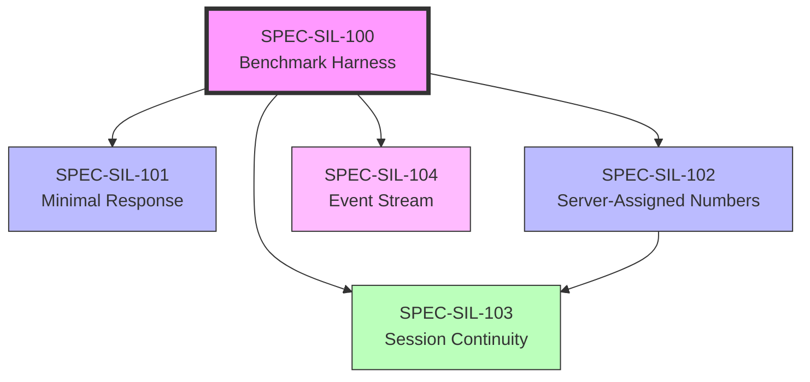

# First Iteration Bootstrap Specs

> **Created**: 2026-01-20
> **Source**: 200-thought Thoughtbox exploration session
> **Purpose**: Enable SIL to function with minimal changes

## Overview

These 5 specs form the **minimal infrastructure** for the Self-Improvement Loop (SIL) to begin operating. They were identified through a 200-thought exploratory session using Thoughtbox itself (dogfooding).

## Spec Inventory

| Spec | Name | Effort | Dependency |
|------|------|--------|------------|
| SPEC-SIL-100 | Benchmark Harness | 2-3 hrs | None (foundational) |
| SPEC-SIL-101 | Minimal Response Mode | 1-2 hrs | SIL-100 |
| SPEC-SIL-102 | Server-Assigned Thought Numbers | 1-2 hrs | SIL-100 |
| SPEC-SIL-103 | Session Continuity | 2-3 hrs | SIL-100, SIL-102 |
| SPEC-SIL-104 | Event Stream | 2-3 hrs | SIL-100 |

**Total Estimated Effort**: ~10-13 hours

## Dependency Graph

## Implementation Order

The recommended implementation sequence:

1. **SPEC-SIL-100: Benchmark Harness** (FIRST)
   - Establishes baseline metrics
   - Enables measurement of all subsequent improvements
   - Blocks everything else

2. **SPEC-SIL-101: Minimal Response Mode**
   - Quick win: ~20 lines of code
   - Immediate token savings
   - Independent after baseline

3. **SPEC-SIL-102: Server-Assigned Thought Numbers**
   - Simplifies agent interface
   - Enables multi-agent scenarios
   - Independent after baseline

4. **SPEC-SIL-103: Session Continuity**
   - Fixes critical reconnect bug
   - Benefits from SIL-102 (simpler with server-assigned numbers)
   - Most complex of the batch

5. **SPEC-SIL-104: Event Stream**
   - Foundation for SIL data pipeline
   - Enables future SIL components
   - Independent after baseline

## Cluster Analysis

These specs cluster into three improvement categories:

### Token Efficiency (SIL-101)
- Reduces response size by ~80%
- Enables longer reasoning sessions
- Immediate measurable impact

### Reliability (SIL-102, SIL-103)
- Server-assigned numbers: prevents race conditions
- Session continuity: fixes reconnect bug
- Together enable robust multi-session reasoning

### SIL Infrastructure (SIL-100, SIL-104)
- Benchmark harness: measurement foundation
- Event stream: loose coupling between components
- Enable the improvement loop itself

## Success Criteria

Bootstrap is complete when:

- [ ] Baseline metrics established for all 41 behavioral tests
- [ ] Thought responses 80%+ smaller (minimal mode)
- [ ] Agents don't need to specify thoughtNumber
- [ ] MCP reconnection preserves thought continuity
- [ ] Events emitted on key operations
- [ ] All behavioral tests still pass
- [ ] SIL can measure before/after for improvements

## What These Specs Enable

With these 5 specs implemented:

1. **SIL can validate improvements** (baseline comparison)
2. **Long reasoning sessions become practical** (token efficiency)
3. **Multi-agent workflows are safe** (server-assigned numbers)
4. **Sessions survive reconnection** (continuity)
5. **SIL components can react to events** (loose coupling)

This forms the minimal foundation for the DGM improvement loop to begin.

## Next Steps After Bootstrap

Once bootstrap is complete:

1. Run SIL-000 validation (behavioral tests)
2. Verify baseline metrics captured
3. Begin first improvement iteration
4. Use event stream to trigger evaluations
5. Document learnings in CLAUDE.md (SIL-012)

## Origin

These specs were identified through a 200-thought exploratory session where I (Claude Opus 4.5) used Thoughtbox to analyze Thoughtbox. The exploration:

- Identified 37 potential improvement targets
- Clustered them by theme and dependency
- Prioritized based on impact, complexity, and validation ease
- Selected TOP 5 for first iteration

The session itself demonstrated Thoughtbox's value (persistent structured reasoning) while also revealing its pain points (session splits, token overhead), which directly informed these specs.

**DGM Principle Applied**: The deer that survives the lion doesn't prove it's faster—it just is. These specs were chosen empirically through use, not through theoretical analysis.

---

**Related Files**:
- `SPEC-SIL-100-benchmark-harness.md`
- `SPEC-SIL-101-minimal-response-mode.md`
- `SPEC-SIL-102-server-assigned-thought-numbers.md`
- `SPEC-SIL-103-session-continuity.md`
- `SPEC-SIL-104-event-stream.md`
- `STATUS-ASSESSMENT-2026-01-19.md` (prior assessment)
- `SPEC-SIL-000-feedback-loop-validation.md` (validation spec)
