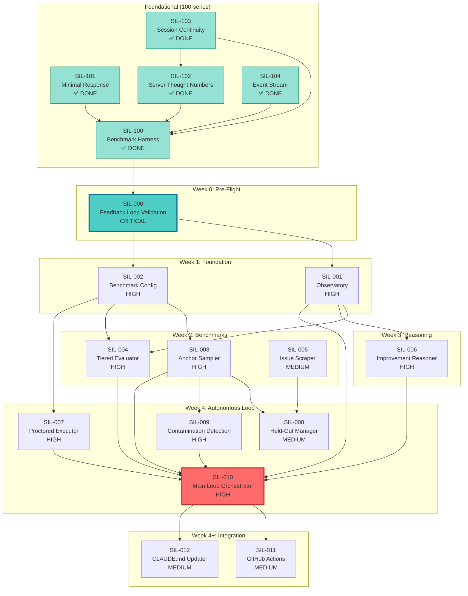

# SIL Specs Dependency Graph

**Version**: 1.0
**Generated**: 2026-01-21

## Visual Dependency Graph



---

## Dependency Matrix

| Spec | Depends On | Blocks | Can Parallel With |
|------|------------|--------|-------------------|
| **SIL-000** | Foundational (100-104) | SIL-001, SIL-002 | - |
| **SIL-001** | SIL-000 | SIL-004, SIL-006, SIL-010 | SIL-002 |
| **SIL-002** | SIL-000 | SIL-003, SIL-004, SIL-007 | SIL-001 |
| **SIL-003** | SIL-002 | SIL-008, SIL-009, SIL-010 | SIL-004, SIL-005 |
| **SIL-004** | SIL-001, SIL-002 | SIL-010 | SIL-003, SIL-005 |
| **SIL-005** | - | SIL-008 | SIL-001 through SIL-004 |
| **SIL-006** | SIL-001 | SIL-010 | SIL-003, SIL-004, SIL-005 |
| **SIL-007** | SIL-002 | SIL-010 | SIL-003, SIL-004, SIL-005, SIL-006 |
| **SIL-008** | SIL-003, SIL-005 | - | SIL-009 |
| **SIL-009** | SIL-003 | SIL-010 | SIL-008 |
| **SIL-010** | SIL-001, SIL-003, SIL-004, SIL-006, SIL-007, SIL-009 | SIL-011, SIL-012 | - |
| **SIL-011** | SIL-010 | - | SIL-012 |
| **SIL-012** | SIL-010 | - | SIL-011 |

---

## Foundational Specs (100-series)

All complete as of 2026-01-21:

| Spec | Status | Implementation |
|------|--------|----------------|
| SIL-100 | ✅ DONE | `dgm-specs/harness/` |
| SIL-101 | ✅ DONE | `verbose` option in thought-handler |
| SIL-102 | ✅ DONE | `thoughtNumber` optional in schema |
| SIL-103 | ✅ DONE | `restoreFromSession()` method |
| SIL-104 | ✅ DONE | `emitThoughtAdded()` events |

---

## Critical Path Analysis

### Path 1 (Longest - through Reasoner)
```
SIL-000 (done) → SIL-001 (2d) → SIL-006 (3d) → SIL-010 (3d) → SIL-011 (2d)
Total: 10 days
```

### Path 2 (through Benchmarks)
```
SIL-000 (done) → SIL-002 (2d) → SIL-003 (2d) → SIL-009 (2d) → SIL-010 (3d)
Total: 9 days
```

### Path 3 (through Evaluator)
```
SIL-000 (done) → SIL-002 (2d) → SIL-004 (3d) → SIL-010 (3d)
Total: 8 days
```

**Critical Path**: Path 1 (10 days through SIL-006)

---

## Implementation Waves

### Wave 1: Foundation (Can Parallelize)
**Duration**: 2-3 days

```
SIL-001 (Observatory)     ─┬─ Parallel
SIL-002 (Benchmark Config) ─┘
```

### Wave 2: Benchmarks (Partially Parallel)
**Duration**: 3-4 days

```
SIL-003 (Sampler)    ─┬─ Parallel (after SIL-002)
SIL-004 (Evaluator)  ─┤
SIL-005 (Scraper)    ─┤  (independent)
SIL-006 (Reasoner)   ─┘  (after SIL-001)
SIL-007 (Proctor)    ─── (after SIL-002)
```

### Wave 3: Gaming Prevention (Can Parallelize)
**Duration**: 2-3 days

```
SIL-008 (Held-Out)       ─┬─ Parallel
SIL-009 (Contamination)  ─┘
```

### Wave 4: Integration (Sequential)
**Duration**: 3-4 days

```
SIL-010 (Main Loop) ─── Must wait for all above
    │
    ├── SIL-011 (GitHub Actions) ─┬─ Parallel
    └── SIL-012 (CLAUDE.md)       ─┘
```

**Total with parallelization**: ~12-14 days

---

## Current Status

> **Source of Truth**: `dgm-specs/implementation-status.json`
> **Last Synced**: 2026-01-21

| Spec | Status | Notes |
|------|--------|-------|
| SIL-000 | ✅ DONE | 3 validation runs, baseline established |
| SIL-001 | ✅ DONE | `improvement-tracker.ts` + tests |
| SIL-002 | ✅ DONE | `suite.yaml` + `config-loader.ts` + tests |
| SIL-003 | 🔴 NOT STARTED | UNBLOCKED - ready to implement |
| SIL-004 | 🔴 NOT STARTED | UNBLOCKED - ready to implement |
| SIL-005 | 🔴 NOT STARTED | UNBLOCKED - no dependencies |
| SIL-006 | 🔴 NOT STARTED | UNBLOCKED - ready to implement |
| SIL-007 | 🔴 NOT STARTED | UNBLOCKED - ready to implement |
| SIL-008 | 🔴 BLOCKED | Waiting on SIL-003, SIL-005 |
| SIL-009 | 🔴 BLOCKED | Waiting on SIL-003 |
| SIL-010 | 🔴 BLOCKED | Waiting on 003, 004, 006, 007, 009 |
| SIL-011 | 🔴 BLOCKED | Waiting on 010 |
| SIL-012 | ✅ DONE | `claude-md-updater.ts` + tests |

---

## Next Actions

1. **SIL-001** (Observatory) - Add improvement-tracker to existing observatory
2. **SIL-002** (Config) - Expand config.yaml with benchmark registry
3. **SIL-006** (Reasoner) - Thoughtbox-based improvement reasoning

These three unblock the critical path to SIL-010.

---

**See Also**:
- `.specs/self-improvement-loop/README.md` - Full spec index
- `dgm-specs/README.md` - Runtime infrastructure
- `dgm-specs/validation/baseline.json` - Current validation baseline
