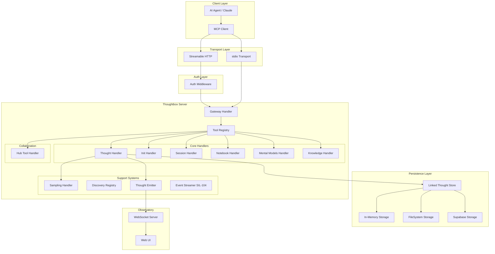
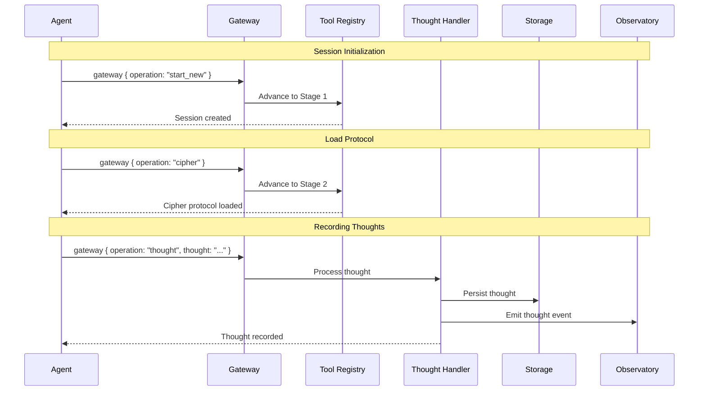
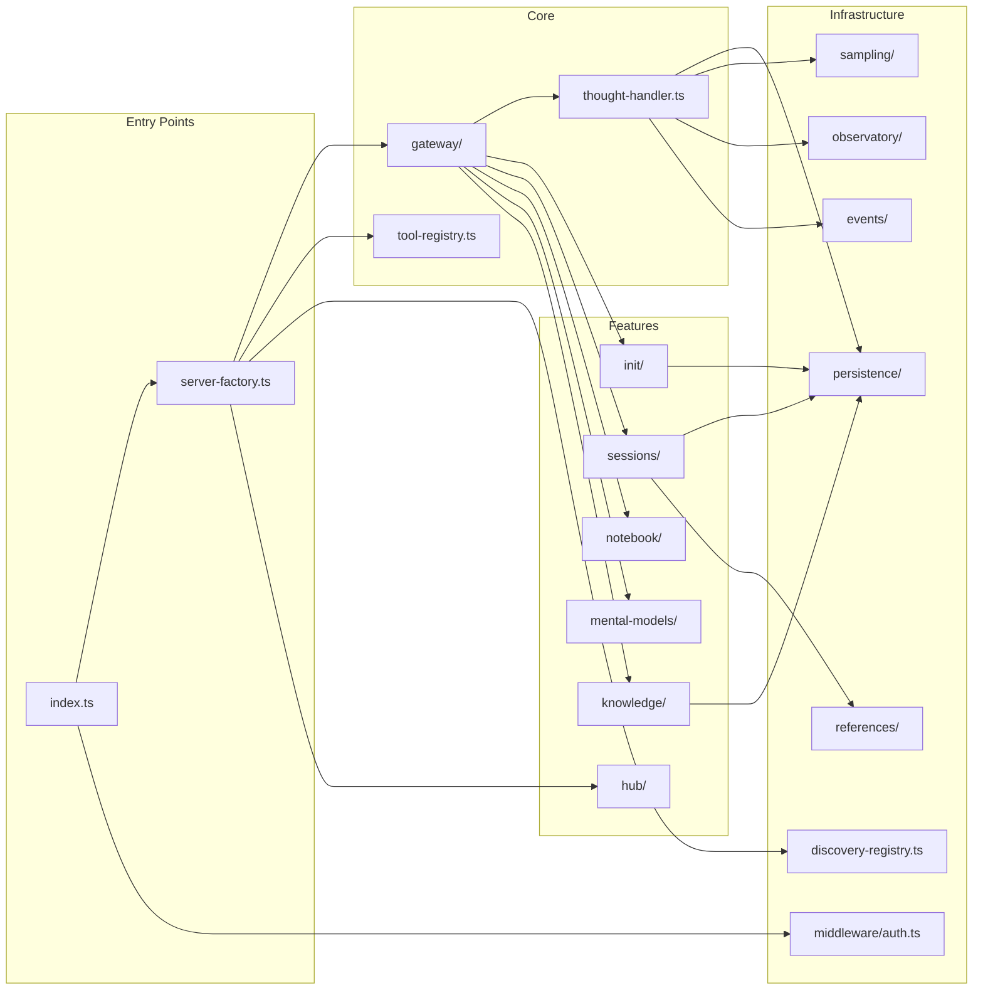
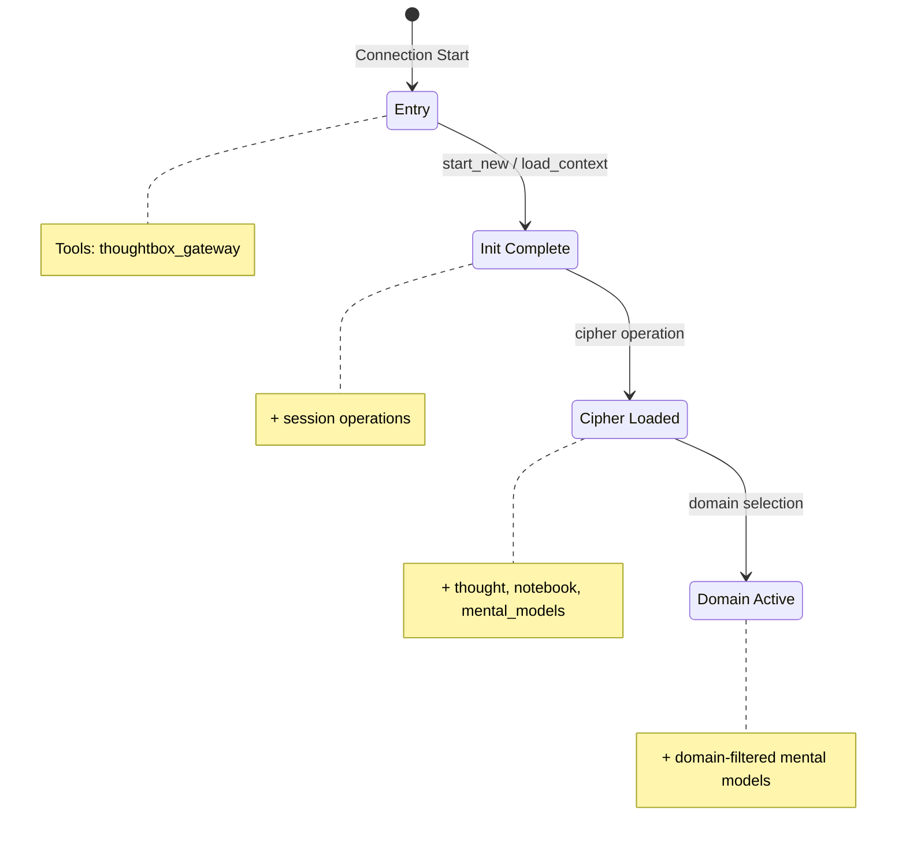
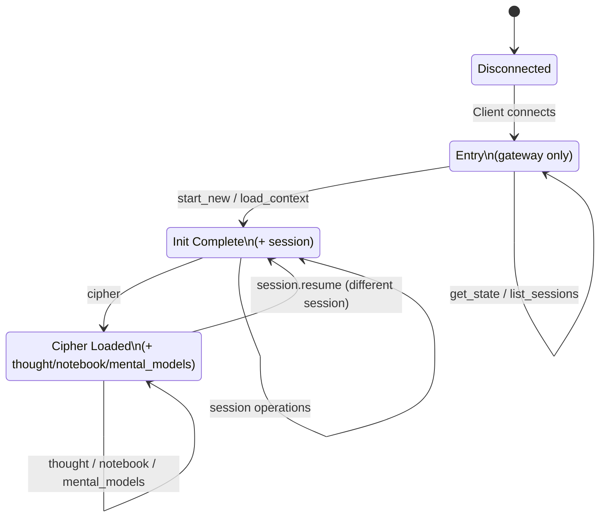
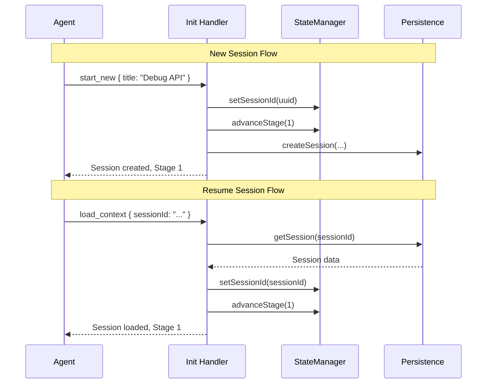
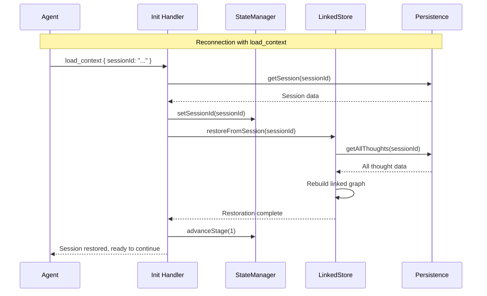
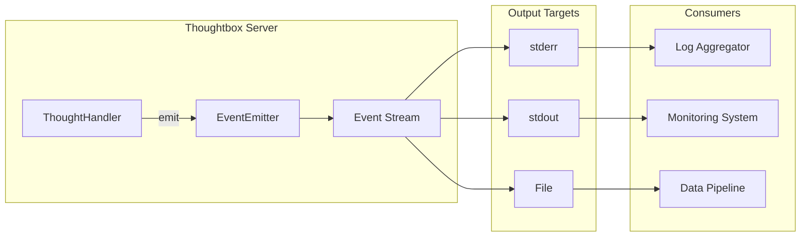
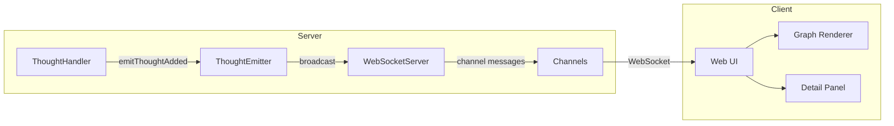
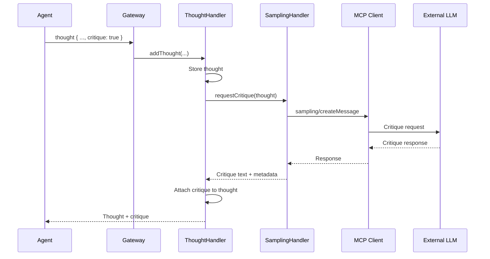

# Thoughtbox Server Architecture

> **Version:** 1.2.2
> **Last Updated:** 2026-03-15
> **Purpose:** Source of truth for Thoughtbox server architecture and data design

---

## Documentation Index

| Document | Description |
|----------|-------------|
| **[ARCHITECTURE.md](./ARCHITECTURE.md)** (this file) | System overview, diagrams, core concepts |
| **[DATA-MODELS.md](./DATA-MODELS.md)** | Complete data model schemas (~40 types) |
| **[TOOL-INTERFACES.md](./TOOL-INTERFACES.md)** | Gateway routing, tool specs, storage interface |
| **[CONFIGURATION.md](./CONFIGURATION.md)** | Environment variables, cipher protocol, appendices |

---

## System Overview

Thoughtbox is an MCP (Model Context Protocol) server providing infrastructure for structured reasoning. It functions as a "reasoning ledger" for AI agents, enabling:

- **Thought Chain Management**: Track reasoning across multiple thoughts with revisions and branches
- **Auto-Numbering (SIL-102)**: Optional thought numbers - server auto-assigns if omitted
- **Session Continuity (SIL-103)**: Seamless state restoration on reconnect via `restoreFromSession()`
- **Event Streaming (SIL-104)**: JSONL event output for external consumers
- **Progressive Disclosure**: Stage-based tool availability for guided agent onboarding
- **Formal Protocol**: Cipher notation for deterministic server-side parsing
- **Real-Time Visualization**: Observatory WebSocket server for live reasoning graphs
- **Autonomous Critique**: MCP sampling API integration for LLM-based critique loops
- **Knowledge Graph**: Entity-relation-observation memory system for cross-session knowledge
- **Multi-Agent Hub**: Workspace-based collaboration with problems, proposals, consensus, and channels
- **Auth & Multi-Tenancy**: Supabase OAuth 2.1 with workspace/membership-based RLS (deployed mode)

---

## Component Interaction Flow

---

## Module Dependency Graph

---

## Progressive Disclosure System

The Tool Registry manages 4 stages of tool availability:

| Stage | Name | Tools Available | Trigger |
|-------|------|-----------------|---------|
| **0** | Entry | `thoughtbox_gateway` | Connection start |
| **1** | Init Complete | + `session`, `deep_analysis` operations | `start_new` or `load_context` |
| **2** | Cipher Loaded | + `thought`, `read_thoughts`, `get_structure`, `notebook`, `mental_models`, `knowledge_*` | `cipher` operation |
| **3** | Domain Active | + domain-filtered mental models | Domain selected |

**Implementation:** `src/tool-registry.ts`

---

## Session Management

### State Machine

### Session Lifecycle

### Session Continuity (SIL-103)

When an MCP connection resets (client disconnect, network interruption), Thoughtbox preserves session state:

**Key behaviors:**
- Full thought chain reconstruction from persistence
- Branch and revision links restored
- Next thought number calculated automatically
- Seamless continuation from last thought

**Implementation:** `src/thought-handler.ts:restoreFromSession()`

---

## Event Streaming (SIL-104)

External consumers can receive Thoughtbox events via JSONL streaming:

**Event Types** (defined in `src/events/types.ts`):
- `session_created` - New session created
- `thought_added` - New thought recorded
- `branch_created` - New branch started
- `session_completed` - Session completed (final thought with `nextThoughtNeeded: false`)
- `export_requested` - Session exported

**Configuration:** See [CONFIGURATION.md](./CONFIGURATION.md#event-streaming)

---

## Observatory (Real-Time Visualization)

| Feature | Description |
|---------|-------------|
| Live Graph | Real-time reasoning visualization |
| Snake Layout | Compact left-to-right flow |
| Branch Rendering | Hierarchical branch display |
| Node Expansion | Click to explore thought details |
| Session Switching | Multi-session support |
| Detail Panel | Full thought inspection |

**Default port:** 1729 (taxicab number)

---

## Sampling Handler (Autonomous Critique)

---

## Knowledge Graph (Cross-Session Memory)

The knowledge graph provides persistent entity-relation-observation storage for cross-session learning. Operations are routed through `thoughtbox_gateway` with `knowledge_` prefixed operations (Stage 2).

| Component | Description |
|-----------|-------------|
| Entity | Named knowledge node with type (`Insight`, `Concept`, `Workflow`, `Decision`, `Agent`) |
| Relation | Directed edge between entities (`RELATES_TO`, `BUILDS_ON`, `CONTRADICTS`, etc.) |
| Observation | Atomic fact attached to an entity, with source session linkage |

**Operations:** `knowledge_create_entity`, `knowledge_get_entity`, `knowledge_list_entities`, `knowledge_add_observation`, `knowledge_create_relation`, `knowledge_query_graph`, `knowledge_stats`

**Storage backends:**
- `src/knowledge/storage.ts` - FileSystem + SQLite (local mode)
- `src/knowledge/supabase-storage.ts` - Supabase Postgres (deployed mode)

**Handler:** `src/knowledge/handler.ts`

---

## Multi-Agent Hub

The hub system (`thoughtbox_hub` tool) enables multi-agent collaboration through workspaces. It is a separate MCP tool (not routed through `thoughtbox_gateway`).

| Concept | Description |
|---------|-------------|
| Workspace | Shared collaboration space containing problems, proposals, consensus markers, and channels |
| Problem | Unit of work with status tracking (`open` → `in-progress` → `resolved` → `closed`) and dependencies |
| Proposal | Proposed solution referencing a thought branch, reviewed and merged by other agents |
| Consensus | Decision marker with thought reference, endorsed by team members |
| Channel | Message stream scoped to a problem for discussion |
| Profile | Role specialization (`MANAGER`, `ARCHITECT`, `DEBUGGER`, `SECURITY`, `RESEARCHER`, `REVIEWER`) |

**Operations include:** `register`, `whoami`, `quick_join`, `create_workspace`, `join_workspace`, `list_workspaces`, `workspace_status`, `create_problem`, `claim_problem`, `update_problem`, `list_problems`, `create_proposal`, `review_proposal`, `merge_proposal`, `list_proposals`, `mark_consensus`, `endorse_consensus`, `list_consensus`, `post_message`, `read_channel`, `get_profile_prompt`

**Implementation:** `src/hub/`

---

## Auth Middleware (Supabase OAuth 2.1)

In Supabase storage mode (`THOUGHTBOX_STORAGE=supabase`), the HTTP transport enforces JWT-based authentication. In FS mode, auth is skipped entirely.

| Component | Description |
|-----------|-------------|
| `src/middleware/auth.ts` | JWT validation via JWKS (RS256), Bearer token extraction |
| `src/index.ts` | Conditional auth enforcement based on storage type |

**Flow:** Client sends Bearer token in `Authorization` header (or `?token=` query param as workaround). Server validates against Supabase JWKS endpoint, extracts `AuthContext` (userId, clientId, role, email), and passes the raw token to storage backends for RLS enforcement.

**Multi-tenancy model:** Workspace memberships control access. Product tables (`sessions`, `thoughts`, `entities`, `relations`, `observations`) use RLS policies that call `user_can_access_project(project)`, which checks workspace membership via `auth.uid()`.

**Schema:** `supabase/migrations/20260313100000_auth_workspace_tables.sql`

---

## Key Architectural Patterns

### Gateway-Only Architecture

All reasoning operations route through a single `thoughtbox_gateway` tool. This bypasses client tool list refresh limitations common in streaming HTTP. The hub and observability tools are separate MCP tools.

### Dual Storage Backend

FileSystemStorage (local/self-hosted) and SupabaseStorage (deployed) coexist. Both implement the same `ThoughtboxStorage` interface. Backend is selected at startup based on `THOUGHTBOX_STORAGE` env var. Neither replaces the other.

### Linked Thought Store

O(1) thought lookups via node ID map. Supports trees through multiple `next` pointers per node.

### Progressive Disclosure

Stage-based tool visibility guides agents through proper initialization sequence.

### Fire-and-Forget Events

Observatory emitter doesn't block reasoning on listener failures.

### Atomic Filesystem Writes

FileSystemStorage uses temp files + atomic rename to prevent corruption.

---

## Quick Reference

### Core Data Types

| Type | Purpose | See |
|------|---------|-----|
| `ThoughtData` | Individual reasoning step | [DATA-MODELS.md](./DATA-MODELS.md#thoughtdata-schema) |
| `Session` | Container for thought chains | [DATA-MODELS.md](./DATA-MODELS.md#session-schema) |
| `ThoughtNode` | Graph node for linked store | [DATA-MODELS.md](./DATA-MODELS.md#thoughtnode-schema-linked-store) |
| `Entity` | Knowledge graph node | [DATA-MODELS.md](./DATA-MODELS.md#supabase-schema) |
| `Relation` | Knowledge graph edge | [DATA-MODELS.md](./DATA-MODELS.md#supabase-schema) |
| `Observation` | Atomic fact on an entity | [DATA-MODELS.md](./DATA-MODELS.md#supabase-schema) |

### MCP Tools

| Tool Name | Description |
|-----------|-------------|
| `thoughtbox_gateway` | Always-on router for reasoning operations (Stage 0+) |
| `thoughtbox_operations` | Discover available operations and schemas (always available) |
| `thoughtbox_hub` | Multi-agent collaboration hub (always available) |
| `observability_gateway` | System observability queries (always available) |

### Gateway Operations

| Operation | Stage | Purpose | See |
|-----------|-------|---------|-----|
| `start_new` | 0 → 1 | Create new session | [TOOL-INTERFACES.md](./TOOL-INTERFACES.md#gateway-architecture) |
| `load_context` | 0 → 1 | Resume existing session (SIL-103) | [TOOL-INTERFACES.md](./TOOL-INTERFACES.md#gateway-architecture) |
| `cipher` | 1 → 2 | Load protocol notation | [CONFIGURATION.md](./CONFIGURATION.md#cipher-protocol) |
| `thought` | 2 | Record reasoning step (SIL-102 auto-number) | [TOOL-INTERFACES.md](./TOOL-INTERFACES.md#thought-tool) |
| `read_thoughts` | 2 | Query thoughts from session | [TOOL-INTERFACES.md](./TOOL-INTERFACES.md#read-thoughts-tool) |
| `get_structure` | 2 | Get reasoning graph topology | [TOOL-INTERFACES.md](./TOOL-INTERFACES.md#get-structure-tool) |
| `deep_analysis` | 1 | Advanced session pattern analysis | [TOOL-INTERFACES.md](./TOOL-INTERFACES.md#deep-analysis-tool) |
| `knowledge_*` | 2 | Knowledge graph operations | [TOOL-INTERFACES.md](./TOOL-INTERFACES.md#knowledge-graph-tool) |

### Configuration

| Variable | Default | See |
|----------|---------|-----|
| `THOUGHTBOX_TRANSPORT` | `http` | [CONFIGURATION.md](./CONFIGURATION.md#environment-variables) |
| `THOUGHTBOX_STORAGE` | `fs` | [CONFIGURATION.md](./CONFIGURATION.md#environment-variables) |
| `PORT` | `1731` | [CONFIGURATION.md](./CONFIGURATION.md#environment-variables) |
| `SUPABASE_URL` | (none) | [CONFIGURATION.md](./CONFIGURATION.md#environment-variables) |

---

*This document is the source of truth for Thoughtbox server architecture.*

*For detailed specifications, see: [Data Models](./DATA-MODELS.md) | [Tool Interfaces](./TOOL-INTERFACES.md) | [Configuration](./CONFIGURATION.md)*
